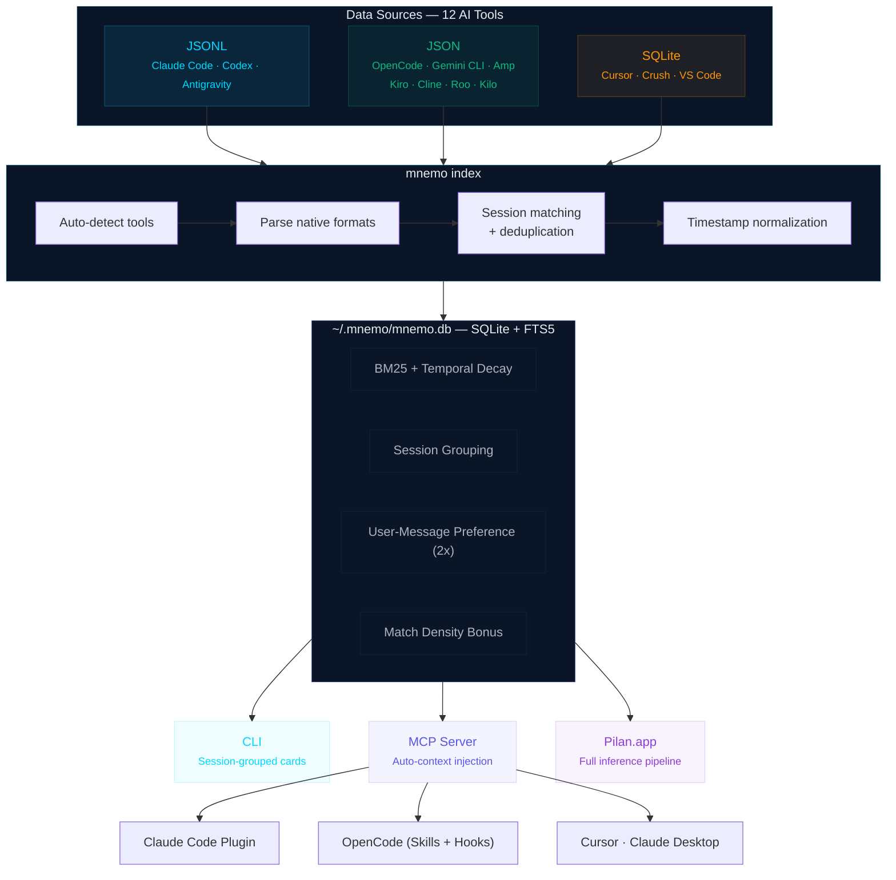

# mnemo

**Instant local search and indexing across all your AI coding sessions.**

Hi all! I'm Raghu. I'm an average Claude Code and OpenCode user. When I ran the numbers, I had 89,037 messages sitting across my AI coding tools. While organizing those chats, I realized they weren't just conversations — they were my 'decision journals'. Why I picked one architecture over another, how I debugged that weird race condition at 2am, what trade-offs I accepted and why. All of it scattered across 12 different tools in 3 different formats.

So I built mnemo. It indexes everything into one local SQLite database and gives you full-text search across all of it. No cloud, no accounts, everything stays on your machine.

## Install

```bash
# macOS / Linux
brew install Pilan-AI/tap/mnemo

# From source
go install github.com/Pilan-AI/mnemo@latest
```

## Quick start

```bash
# First run — scans your tools, indexes recent history
mnemo index

# Search across everything
mnemo search "authentication flow"

# See what you've been working on
mnemo recent --days=7

# Load context into a new session
mnemo context my-project
```

That's it. `mnemo index` auto-detects your installed tools, parses their native formats, and builds the search index. Subsequent runs are incremental.

## Supported tools

mnemo reads the native storage format of each tool directly. No exports, no copy-paste, no API keys.

| Tool | Format | What it reads |
|------|--------|---------------|
| Claude Code | JSONL | `~/.claude/projects/`, transcripts, XDG paths |
| OpenCode | JSON | `~/.local/share/opencode/` message + session dirs |
| Gemini CLI | JSON | `~/.gemini/sessions/` + new tmp/chats format |
| Cursor | SQLite | globalStorage `state.vscdb` composer data |
| Crush | SQLite | `~/.crush/crush.db` + per-project databases |
| Codex | JSONL | `~/.codex/sessions/` + archived sessions |
| Amp | JSON | `~/.local/share/amp/threads/` with usage ledger |
| Kiro | JSON | globalStorage workspace-sessions |
| Antigravity | JSONL | `~/.gemini/antigravity/code_tracker/` |
| Kilo Code | JSON | VS Code extension `tasks/ui_messages.json` |
| Cline | JSON | VS Code extension `tasks/ui_messages.json` |
| Roo Code | JSON | VS Code extension `tasks/ui_messages.json` |

## Search

mnemo search groups results by session, not by message. When you search for "liquid design," you get the 5 most relevant sessions — not 10 scattered messages that may all come from the same conversation.

```bash
# Session-grouped results with highlighted snippets
mnemo search "liquid design"

# Token-efficient format for AI context injection
mnemo search "auth flow" --context

# Full JSON for programmatic use
mnemo search "auth flow" --json
```

Results are ranked using a composite score that combines full-text relevance (BM25) with temporal decay — recent sessions naturally surface above older ones. Sessions with more matching messages score higher, and your own messages are weighted above assistant responses, since what you asked reveals more about intent than what the AI answered.

The `--context` flag produces a compact format designed for injection into AI coding sessions. Five results in ~250 tokens instead of ~2,000.

## Plugins

If you use Claude Code or OpenCode, the plugins give you a much deeper integration than raw MCP. Your AI assistant gets access to your past sessions as context — it remembers what you discussed last week.

### Claude Code plugin

```bash
mnemo install claude-code
```

This installs the [mnemo-memory plugin](#claude-code-plugin) which gives you:

- **Auto-context** — past session context loads automatically when you start working
- `/mnemo-memory:remember <query>` — search past sessions from inside Claude Code
- `/mnemo-memory:recall` — load full project memory into your current session
- **Memory agent** — a specialized subagent for deep context retrieval across projects

### OpenCode plugin

```bash
mnemo install
```

Adds mnemo as an MCP server inside OpenCode. Search and context tools are available directly in your coding session after restarting OpenCode.

## MCP server

For Claude Desktop, Cursor, and other MCP-compatible clients:

```bash
mnemo install
```

This configures your MCP client to launch mnemo automatically. Restart the client after installing. The MCP server exposes four tools: `mnemo_search`, `mnemo_context`, `mnemo_recent`, `mnemo_tools`.

Search results delivered through MCP use the same session-grouped ranking as the CLI but formatted for minimal token usage — your AI assistant gets maximum context in minimum space.

## Several machines, one history (this fork)

`terrillmoore/mnemo` adds what it takes to keep one searchable history across
several machines. Upstream indexes the machine it runs on; this fork can tell
one machine's sessions from another's and can answer queries for a machine that
holds no copy of the data.

- `sessions.host` records the machine a session came from. `mnemo index --host
  NAME` sets it; it defaults to the system hostname. Without it a merged index
  cannot tell two machines apart, because `working_directory` is the same when
  both hold `/home/you/project`.
- `MNEMO_DB` picks the database file, so a machine can keep its own live index
  and a copy of the merged one side by side.
- `mnemo serve` opens the database read-only, which makes it safe to run under
  an ssh forced command: a client cannot trigger a schema migration on someone
  else's index.
- `mnemo migrate host` claims rows written before the column existed, and
  `mnemo migrate status` reports per-host counts.

The arrangement these support: every machine pushes its transcripts to one
archive host, the archive indexes them with `--host`, and a machine that needs
to search everything runs `mnemo serve` **on the archive** through ssh and
registers it as an MCP server. Queries run where the data is and only results
cross the wire, so a shared machine can search the whole history without
holding any of it. A machine that should hold a full copy can fetch the index
instead and search it locally through `MNEMO_DB`.

The pieces above are in the binary. The deployment around them is not, and
there is no central skill or installer here that anyone can use unmodified:
each person sets up their own databases, keys, transfer scripts, and the skill
that tells an agent which of them this machine can reach. Terry Moore's setup
is one worked example, installed from his `personal-claude-context` repo, which
carries the push and pull scripts, the systemd timers, and a `mnemo` skill
whose first section says whether the machine it is installed on can reach the
archive and how. That repo is private; the shape is described here so it can be
rebuilt rather than copied.

## Commands

| Command | What it does |
|---------|-------------|
| `mnemo index` | Index all detected AI tool sessions |
| `mnemo search <query>` | Session-grouped search with intelligent ranking |
| `mnemo recent` | Show recent sessions (default: 7 days) |
| `mnemo context <project>` | Generate project context summary |
| `mnemo status` | Show database stats and background index status |
| `mnemo tools` | List detected AI tools and session counts |
| `mnemo blocks` | Show 5-hour usage blocks with token burn rates |
| `mnemo projects` | Manage tracked project directories |
| `mnemo install` | Install plugins and MCP config |
| `mnemo add <path>` | Index a custom path |
| `mnemo version` | Print version and build info |

## How it works



1. `mnemo index` scans each tool's native storage (JSONL, SQLite, JSON)
2. Messages are normalized into `~/.mnemo/mnemo.db` — a single SQLite file with FTS5 full-text search
3. `mnemo search` groups results by session and ranks them using BM25 relevance, recency weighting, match density, and role preference
4. Results adapt to the consumer — compact cards for humans, token-efficient summaries for AI context, full JSON for programmatic access

The database is a single file. Back it up, move it between machines, query it with any SQLite client.

## Technical details

### Search ranking

mnemo doesn't just match keywords — it ranks results using a composite scoring algorithm:

```
FinalScore = (BM25 - densityBonus - userBonus) * temporalDecay
```

| Factor | How it works |
|--------|-------------|
| **BM25** | SQLite FTS5's built-in relevance ranking. Handles term frequency, document length normalization, and inverse document frequency automatically. |
| **Temporal decay** | `e^(-0.03 * daysOld)` — exponential decay so last week's sessions score ~80%, last month's ~40%, 3 months ago ~10%. Recent decisions surface first. |
| **Match density** | Sessions with multiple matching messages get a bonus (capped at 20 matches to prevent runaway scores from mega-sessions). |
| **User-message preference** | Your prompts are weighted 2x over assistant responses. What you asked reveals more about intent than what the AI answered. |

Results are grouped by session, not by message. When you search for "auth flow," you get the 5 most relevant sessions — not 50 scattered messages from the same conversation.

### Context injection

mnemo auto-injects relevant past context into your AI coding sessions via Claude Code's `UserPromptSubmit` hook. Here's what actually happens on every prompt:

1. Claude Code passes your prompt as JSON on stdin to `mnemo inject`
2. Keywords are extracted (stop words removed, first 200 chars, max 10 terms)
3. FTS5 search runs against the local SQLite database (~0.8s, no network)
4. Top 3 sessions are formatted as a plain text summary (~200-500 tokens)
5. Claude Code injects this as additional context before processing

The injection mode controls when this fires:

| Mode | Behavior | Best for |
|------|----------|----------|
| `off` | No auto-injection. Use `/remember` manually | Minimal overhead |
| `helper` | Inject only for code/debug prompts | Most users |
| `assistant` | Inject on every prompt | Heavy context switching |

**Token overhead**: ~0.1-0.3% increase per session. The savings come from not re-explaining context that the AI already discussed with you last week.

### Database design

Everything lives in a single SQLite file (`~/.mnemo/mnemo.db`) using WAL mode for concurrent reads:

- **FTS5 virtual table** with BM25 ranking — no external search engine needed
- **WAL mode** — multiple readers (MCP servers, CLI) never block each other
- **Read-only mode for hooks** — inject opens the DB without write locks, so it can't be blocked by background indexing
- **Single-writer constraint** (`MaxOpenConns=1`) — prevents "database is locked" errors during indexing
- **Atomic transactions** — each tool's sessions index fully or roll back. No partial writes on interruption.

The database is portable. Copy `~/.mnemo/mnemo.db` to another machine, and all your indexed sessions come with it. Query it with any SQLite client (`sqlite3`, DB Browser, Datasette).

### Zero dependencies at runtime

mnemo is a single static binary. No CGO, no system SQLite, no runtime dependencies.

| Decision | Why |
|----------|-----|
| **Pure-Go SQLite** ([modernc.org/sqlite](https://pkg.go.dev/modernc.org/sqlite)) | Cross-compiles to every platform without C toolchain. Same SQLite behavior everywhere. |
| **No config files required** | Auto-detects tools by scanning known paths. Works on first run with `mnemo index`. |
| **No cloud, no accounts** | Data never leaves your machine. No telemetry, no analytics, no network calls. |
| **No background daemon** | Indexing runs on-demand or via optional cron/launchd. No process sitting in your tray. |

### Indexer architecture

Each AI tool stores conversations differently. mnemo has 12 dedicated indexers that parse native formats:

```
JSONL parsers   → Claude Code, Codex, Antigravity
JSON parsers    → OpenCode, Gemini CLI, Amp, Kiro, Cline, Roo Code, Kilo Code
SQLite readers  → Cursor, Crush
```

Every indexer:
- Auto-detects the tool's data directory across macOS, Linux, and Windows
- Handles format variations (OpenCode changed their schema twice, Gemini CLI has 3 different path layouts)
- Deduplicates messages by content hash to prevent double-counting
- Normalizes timestamps to UTC
- Runs inside a transaction — either the full session indexes or nothing does

## Platform support

- **macOS** (Apple Silicon + Intel)
- **Linux** (arm64 + amd64)
- **Windows** (amd64)

Built with pure-Go SQLite ([modernc.org/sqlite](https://pkg.go.dev/modernc.org/sqlite)) — no CGO, no system dependencies. Single binary, runs anywhere.

## Why not grep?

grep searches text. mnemo searches **sessions**.

- grep can't parse 12 different formats (JSONL, SQLite, JSON) into meaningful conversations
- grep doesn't rank results by relevance or weight recent sessions above old ones
- grep doesn't know that a Claude Code JSONL file and a Cursor SQLite database contain the same kind of data
- grep gives you matching lines; mnemo gives you the right session with project, tool, and time context

If you use one tool and remember exact strings, grep works. If you use multiple tools and want to find "that auth discussion from last week," you need mnemo.

## What's next

mnemo is the first tool from [Pilan](https://pilan.ai). Later this month, we're launching a native macOS app that sits on top of mnemo — knowledge graph, pattern recognition, session intelligence. If mnemo is the memory, Pilan is the brain.

## Uninstall

```bash
brew uninstall mnemo
# or: rm $(which mnemo)

# Remove indexed data (optional)
rm -rf ~/.mnemo
```

## License

MIT. See [LICENSE](./LICENSE).

---

[GitHub](https://github.com/Pilan-AI/mnemo) · [X](https://x.com/Pilan_AI) · [Pilan](https://pilan.ai)

Built by 0xRaghu

[LinkedIn](https://linkedin.com/in/0xRaghu) | [X](https://x.com/Pilan_AI)

---

<div align="center">

*எண்ணென்ப ஏனை எழுத்தென்ப இவ்விரண்டும்*
*- கண்ணென்ப வாழும் உயிர்க்கு.*

Numbers and letters — these two
are the eyes of all who live.

— Thiruvalluvar, Tirukkural 392

</div>
